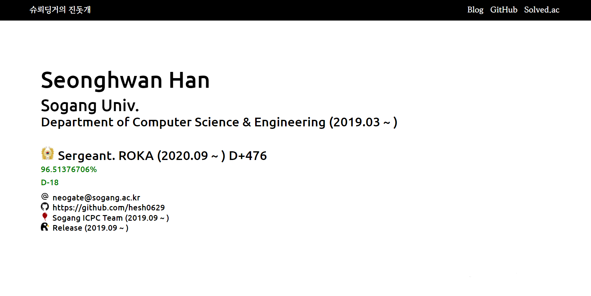

<<<<<<< HEAD
# blog_project
</img>  
<b>블로그 만들기 프로젝트 with React</b>  
<b>Link: https://hesh0629.github.io</b>
## ref  
<ul>
  <li>google font : https://fonts.google.com/</li>
  <li>이미지 배경 제거 : https://www.remove.bg/ko</li>
  <li>flex 관련 정리글 : https://studiomeal.com/archives/197</li>
  <li>useEffect 관련글1: https://yechoi.tistory.com/87</li>
  <li>useEffect 관련글2: https://react.vlpt.us/basic/16-useEffect.html</li>
  <li>Intersection Observer1: https://www.remove.bg/ko</li>
  <li>Intersection Observer2: https://shylog.com/react-custom-hooks-scroll-animation-fadein/</li>
  <li>Web photoShop: https://pixlr.com/kr/editor/</li>
  <li>Gradient Color Recommend: https://brunch.co.kr/@forchoon/369</li>
  <li>Git 사용법 정리 https://wordbe.tistory.com/entry/Git-%EC%82%AC%EC%9A%A9-%EB%B0%A9%EB%B2%95-%EC%A0%95%EB%A6%ACcommit-push-pull-request-merge-%EB%93%B1/li>
  <li>VScode git main push 관련 https://jobc.tistory.com/177</li>
</ul>
=======
# Hesh0629.github.io

간단히 나 자신을 소개하는 사이트 with React

edit on goormIDE☁️
>>>>>>> 27e13b052012b955ce05984943862b14513fca5a
